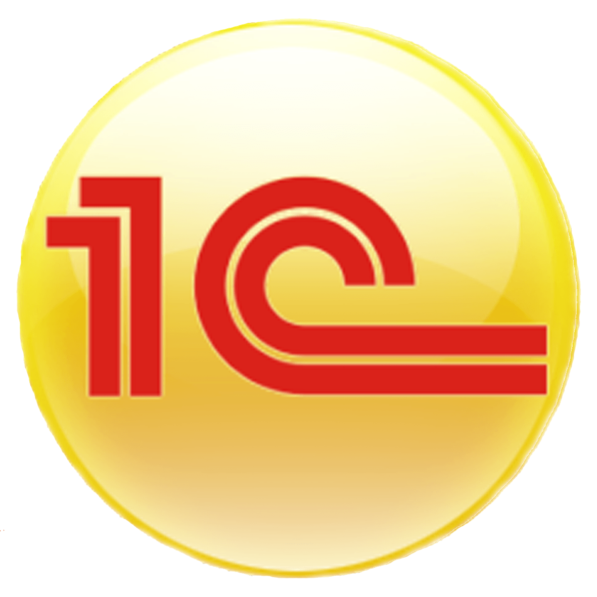
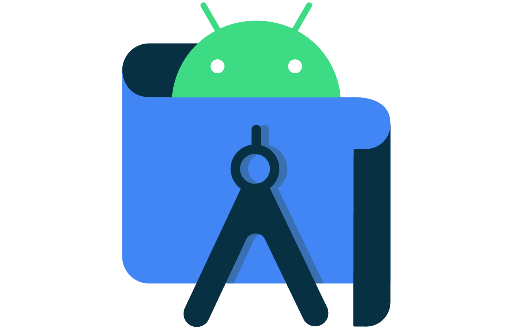
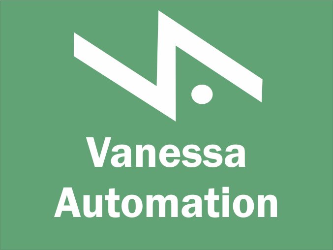
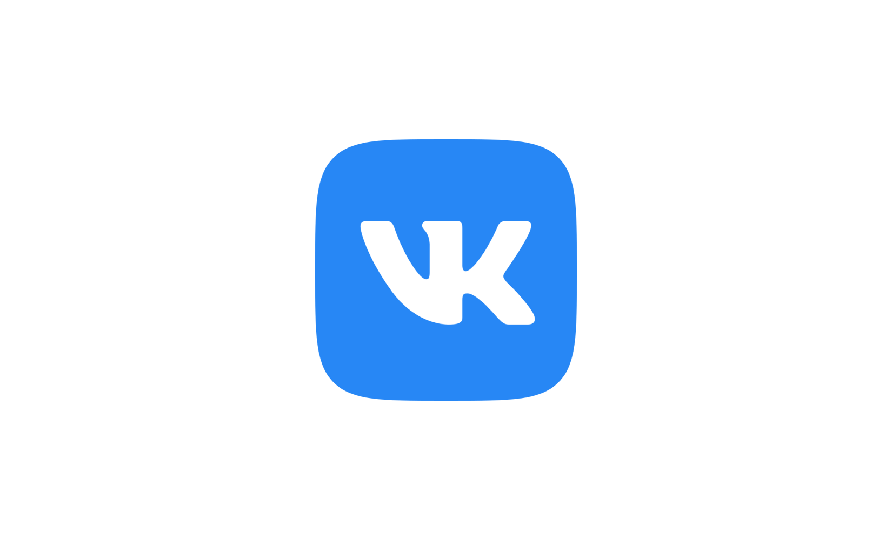

## Привет, меня зовут Александр. 

### 💻 Я программист 1С
###  [Моё резюме](https://docs.google.com/document/d/1u3gx6Z96P8QIBj3xm_XNvQzT_UcnQVUL/edit?usp=sharing&ouid=105470476192297885288&rtpof=true&sd=true)
###  Вот, что я умею 💁

- [Дипломная работа по курсу 1С от Нетологии](https://github.com/AlexShablow/fonecmid-diplom.git)
- [Домашние работы по курсу 1С от Нетологии](https://github.com/AlexShablow/HomeWorksNetology)
###  Инструменты

 

### Связаться со мной:

